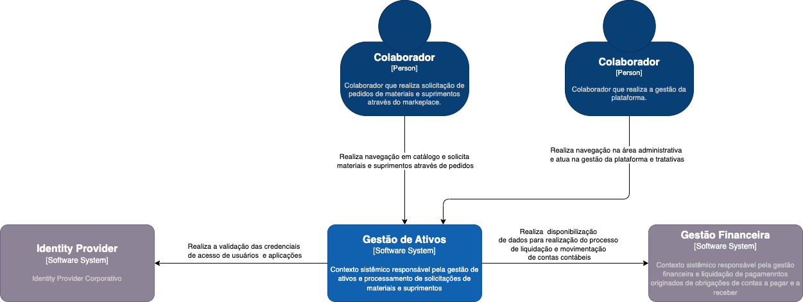
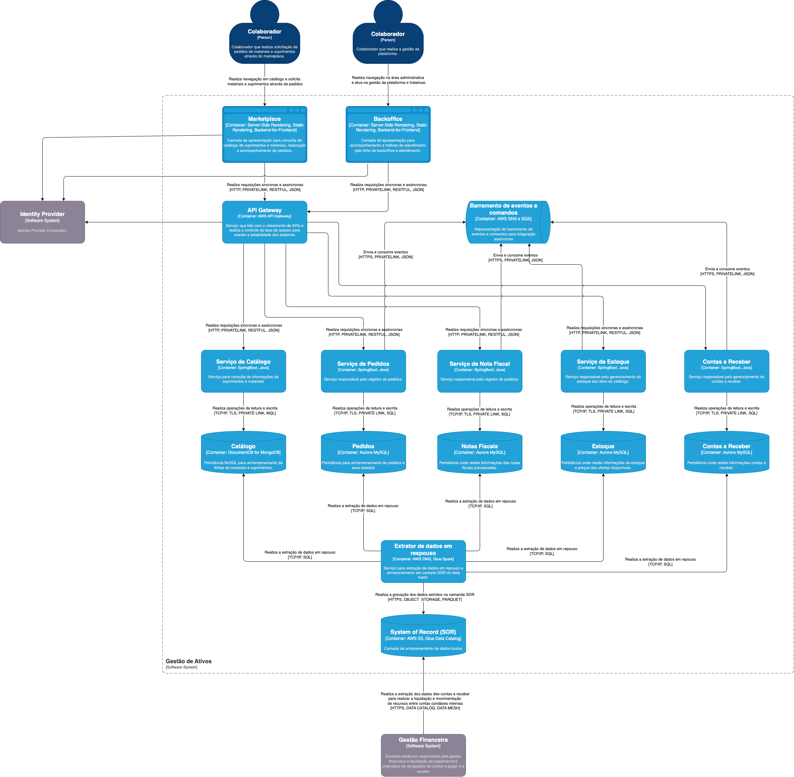

# Caso de Estudo 001 - Sistema de Gestão de Ativos

Este estudo de caso tem como objetivo explorar aplicação de um modelo estrutural de arquitetura baseado em microsserviços e orientada a eventos (EDA), aplicando a construção de designs utilizando serviços da Amazon Web Services e boas práticas de design de aplicações e resilência.

1. [Visão Geral de Arquitetura](#visão-geral-de-arquitetura)
2. [Registro de Decisões Arquiteturais (ADR)](#registro-de-decisões-arquiteturais-adr)
3. [Princípios de Design](#princípios-de-design)
4. [Mecanismos de Arquitetura](#mecanismos-de-arquitetura)
5. [Toplogia de Referência](#toplogia-de-referência)

## Arquitetura de Software e Design

Nesta sessão, você irá encontrar informações quanto as decisões de arquitetura, design e topologia que foram abordadas ao longo da definição da solução para este estudo de caso.

### Visão Geral de Arquitetura

Na visáo geral de arquitetura é abordado a visão das solução em dois níveis, sendo um primeiro contextual demonstrando a as interações macros com o contexto do **Sistema de Gestão de Ativos** e um segundo nível demonstrado as interarções entre os componentes internos do contexto.

#### Visão de contexto (C4 N1)

Abaixo segue a visão contextual da solução:

  

#### Visão de containers (C4 N2)

Abaixo segue a visão de containers da solução:

  

### Registro de Decisões Arquiteturais (ADR)

Abaixo segue a relaçao de registros de decisões arquiteturais realizadas para este projeto:

- [Definição de modelo estrutural de arquitetura](./adrs/adr-001.md)

### Mecanismos Arquiteturais

_Não há mecanismos arquiteturais definidos_

### Princípios de Design

_Não há princípios de design definidos_

### Arquitetura e Topologia de Infraestrutura de Referência

_Não há arquitetura e topologia de infraestrutura de referência definida_
