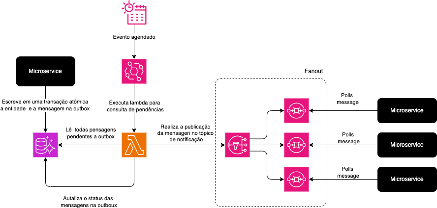

# MECH-001 - Mecanismo de publicação de mensagens outbox table

## Descrição

Este mecanimos tem por definição realizar a publicação de todas as mensagens pendentes na tabela de `outbox` que foram gravadas trasacionalmente em operações de inserção, alteração ou deleção, em um tópico de notificações.

## Design

Abaixo segue a visão de design do mecanismo:

  

Abaixo segue a definição dos campos esperados na estrutura da tabela:

| Campo            | Tipo                   | Obrigatório | Descrição                                                                 |
| ---------------- | ---------------------- | ----------- | ------------------------------------------------------------------------- |
| `id`             | `UUID`                 | ✅          | Identificador único do evento. Usado para rastreabilidade e idempotência. |
| `aggregate_type` | `VARCHAR(50)`          | ✅          | Tipo de agregado de domínio (ex: `NotaFiscal`, `Pedido`).                 |
| `aggregate_id`   | `VARCHAR(50)`          | ✅          | ID da entidade de domínio associada ao evento.                            |
| `event_type`     | `VARCHAR(100)`         | ✅          | Tipo do evento (ex: `NotaFiscalGerada`).                                  |
| `payload`        | `JSONB` ou `TEXT`      | ✅          | Conteúdo do evento serializado em JSON.                                   |
| `status`         | `VARCHAR(20)`          | ✅          | Estado do evento: `PENDING`, `PUBLISHED`, `FAILED`.                       |
| `created_at`     | `TIMESTAMP`            | ✅          | Timestamp de criação do evento.                                           |
| `published_at`   | `TIMESTAMP` (nullable) | ✅          | Timestamp da publicação (caso publicada).                                 |
| `retries`        | `INT`                  | ✅          | Quantidade de tentativas de envio do evento.                              |
| `source_service` | `VARCHAR(50)`          | ✅          | Serviço produtor do evento (ex: `NotaFiscalService`).                     |
| `correlation_id` | `UUID` ou `TEXT`       | ❌          | ID de correlação entre eventos (útil para rastreamento de processos).     |
| `trace_id`       | `VARCHAR(100)`         | ✅          | Trace ID para integração com observabilidade (ex: OpenTelemetry).         |
